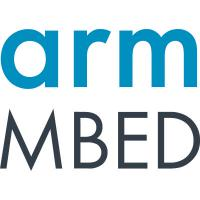
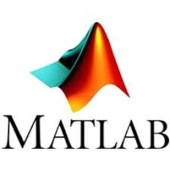

[[English](README.md#readme)] [日本語]

## Mr. Green's Workshop

Mr. Green's Workshopは、ソフトウェア、電子回路、機械関連のプロジェクトや、コンテンツを制作しています。 

#### モチベーション

これまで様々な分野で働き、様々な経験を積んできました。そろそろ何かお返しをする時だと思うのです。私の父がいつもこう言っていました。”あなたがこれまで学んできたことに対する税金を、他の人と分かち合うことで支払いなさい。”と。

#### なぜワークショップ?

私はメイカーとして、ソフトウェア、電子回路、機械をそれぞれ若しくは組み合わせて扱うプロジェクトが好きなので、ワークショップという言葉が一番合っていると思いました。

#### スポンサーシップ

プロジェクトを作っているだけでは、お金になりません。（今日もモヤシか。。。）プロジェクトを作り、維持するためには、多くの時間と労力が必要です。皆さんに新しいコンテンツを提供できるよう、支援をご検討いただければ幸いです。

- [Patreon](https://patreon.com/MrGreenWorkshop "パトロンになる")でパトロンになる（月々）
- [Ko-fi](https://ko-fi.com/MrGreenWorkshop "Patreonで支援")で支援する (一回)
- [GitHubスポンサー](https://github.com/sponsors/MrGreensWorkshop)で支援する (一回／月々)

#### 言語やツールなど

|  |  |
| :------ | ------------------ |
| 言語やフレームワーク | &nbsp; &nbsp; &nbsp; &nbsp; &nbsp; &nbsp; &nbsp; &nbsp; &nbsp; &nbsp; &nbsp; |
| 言語やフレームワーク (Web) | &nbsp; &nbsp; &nbsp; &nbsp; &nbsp; &nbsp; &nbsp; &nbsp;|
| ターゲットOS | &nbsp; &nbsp; &nbsp; &nbsp; |
| ターゲット組み込みOSやプラットフォーム | &nbsp; &nbsp; &nbsp; &nbsp; &nbsp;|
| ツールやエディター | &nbsp; &nbsp; &nbsp; &nbsp; &nbsp; &nbsp; &nbsp; &nbsp; &nbsp; &nbsp; |
| シミュレーター | &nbsp; &nbsp; &nbsp; |
| CADツール | &nbsp; &nbsp; |

- このコンテンツには、[github.com/devicons/devicon](https://github.com/devicons/devicon)、Copyright（c）2015konpaのアイコンが組み込まれています。 [MIT](https://opensource.org/licenses/MIT)ライセンスのもと使用。
- このコンテンツには、[github.com/github/explore](https://github.com/github/explore)のアイコンが組み込まれています。 [CC-BY-4.0](https://creativecommons.org/licenses/by/4.0/)ライセンスのもと使用。
- 外部リンク付きのアイコンは、リンク先から取得したものです。
