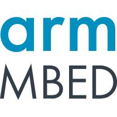
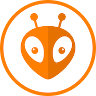
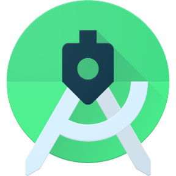
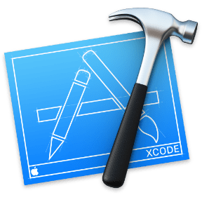
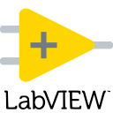

[English] [[日本語](README-jp.md#readme)]

<h2>Mr. Green's Workshop</h2>

#### Motivation

I have worked in different fields and gained different experiences. I think it's time to give something back. My father always said, ”You should pay the tax of what you've learned by sharing it with others.”.

#### Why Workshop?

As a maker, I like projects that involve software, electronic circuits, and mechanics individually or in combination, so I think the word "Workshop" is the best fit.

#### Sponsorship

Creating projects themselves don't pay the bills. It takes a lot of time and efforts to create and maintain projects. I hope you consider supporting me so that I can continue my work and creating new contents for everyone.

- you can be one of my patrons on [Patreon](https://patreon.com/MrGreensWorkshop "Be my Patron") (monthly)
- you can tip me via [Ko-fi](https://www.ko-fi.com/MrGreensWorkshop "Tip Me via Ko-fi") (one time)

#### Languages, tools etc.

|  |  |
| :------ | ------------------ |
| Languages and Frameworks | &nbsp; &nbsp; &nbsp; &nbsp; &nbsp; &nbsp; &nbsp; &nbsp; &nbsp; &nbsp; &nbsp; |
| Languages and Frameworks (Web)| &nbsp; &nbsp; &nbsp; &nbsp; &nbsp; &nbsp; &nbsp; &nbsp;|
| Target OSes | &nbsp; &nbsp; &nbsp; &nbsp; |
| Target Embedded OSes, Platforms | &nbsp; &nbsp; &nbsp; &nbsp; &nbsp;|
| Tools and Editors | &nbsp; &nbsp; &nbsp; &nbsp; &nbsp; &nbsp; &nbsp; &nbsp; &nbsp; &nbsp; |
| Simulators | &nbsp; &nbsp; &nbsp; |
| CAD tools | &nbsp; &nbsp; |

- This content incorporates icons from [github.com/devicons/devicon](https://github.com/devicons/devicon), Copyright (c) 2015 konpa. Used under the [MIT](https://opensource.org/licenses/MIT) license.
- This content incorporates icons from [github.com/github/explore](https://github.com/github/explore). Used under the [CC-BY-4.0](https://creativecommons.org/licenses/by/4.0/) license.
- The icons with external links were obtained from link destinations.
